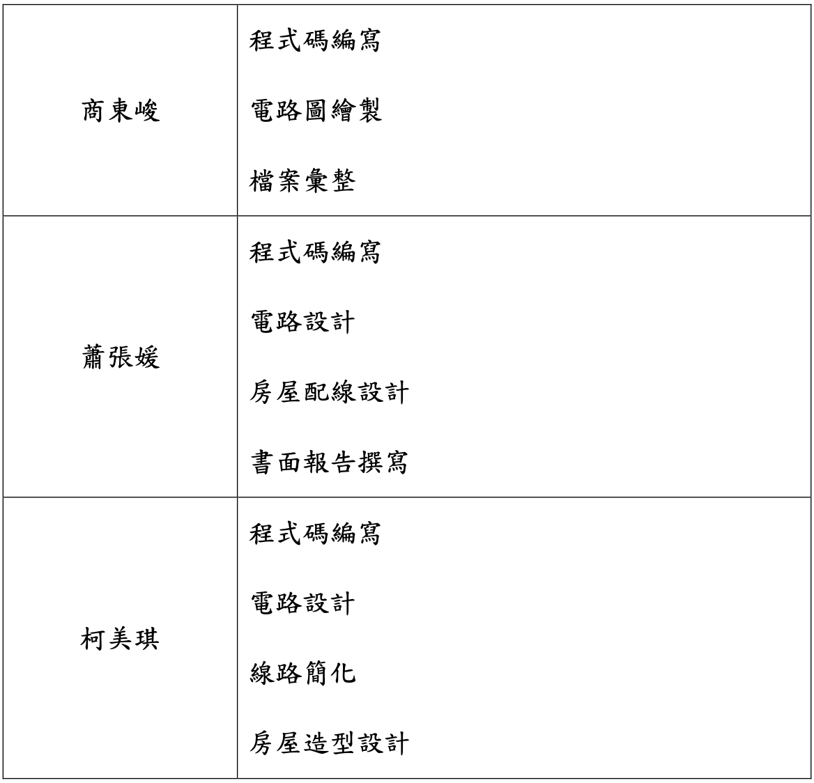

# 智慧家庭之自動瓦斯警報與自動通風示範系統

## 系統簡介
* 此系統使用Arduino以及ESP32所建置而成。
* 使用到的元件
    * 瓦斯偵測器 MQ-2
    * 7 段式顯示器
    * 伺服馬達(180 度)
    * OLED 
    * 蜂鳴器
    * 按鈕
    * LED 燈泡
* 本系統在瓦斯濃度超過臨界值時，會進行警報提醒，包含窗戶自動開啟、LED燈泡的閃爍以及警報聲，另外可使用按鈕來調解瓦斯偵測的敏感程度，也就是觸發警報的臨界值，同時在OLED上會顯示目前的臨界值以及瓦斯濃度等級，而7段顯示器上會另外再顯示即時的瓦斯濃度等級。
*  詳細功能介紹可以前往[專題報告書](書面報告/2022F嵌入式期中報告_第14組.pdf)閱覽，也可以直接觀看[專題Demo影片](https://www.youtube.com/watch?v=cu-i2vF_Y5M)。

## 組員
* 1093332 商東峻 
* 1094842 蕭張媛 
* 1094908 柯美琪

## 工作分配

## Demo影片
* [專題Demo影片](https://www.youtube.com/watch?v=cu-i2vF_Y5M)

